# Identifying Non-Voters to Improve Polling Accuracy in US Presidential Elections
---
Public opinion polling for elections has always faced many challenges, chief among them accurately determining the composition of the electorate. Even with unimpeachable sampling methodologies, pollsters must contend with an inconstant and amorphous notion of what constitutes a likely voter, a notion that, if incorrect, can lead to historic upsets like the 2016 presidential election. Currently, pollsters still employ heuristic measures such as the Perry-Gallup Index developed in the 1950’s to determine their likely voter models. Can machine learning offer a solution to this perennial polling problem?

### Contents

- [Data](#data)
- [Methodology (Part 1)](#methodology-part-1)
- [First Results and a Complication](#first-results-and-a-complication)
- [Methodology (Part 2)](#methodology-part-2)
- [Results](#results)
- [Conclusion](#conclusion)

### Data
To explore this question, I chose to work with data collected by American National Election Studies (ANES), a publically funded election research organization specializing in time series studies. Like many election polls, ANES surveys are conducted from the sample universe of eligible voters, defined as US citizens age 18 or older who are eligible to register and vote, but these surveys differ from typical election polling in two key respects. First, at approximately 80 minutes in length, the interviews are much more thorough, resulting in a richer dataset. Second and most crucially, ANES follows up with its respondents for a post-election interview in which the respondents are asked about whether they voted, providing the ground truth for a classic supervised learning problem. Of particular interest was the ANES Cumulative Data File, a merged dataset containing common features from all time series studies conducted since 1948. However, to reduce the scope of the project to recent elections, I only examined presidential election data from 2000 to 2012.

Even without machine learning, one can gain insights about voting propensity from the cumulative data file. Figure 1 shows non-voters skew younger than voters by a median of five years and that this pattern holds true across multiple election years.

  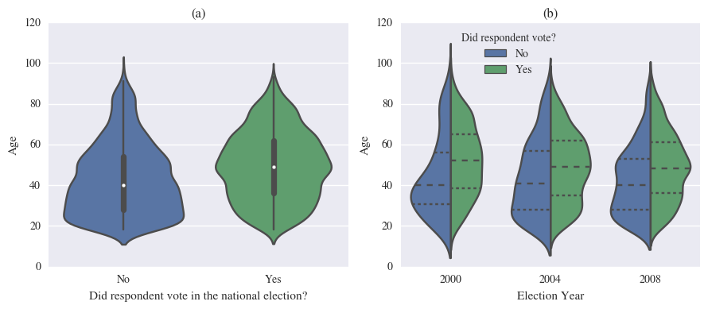
  <b>Figure 1: Age distribution of voters and non-voters.</b>
                (a) Data from 2000-2008

Figure 2 shows that whites and blacks have the highest vote participation rates, but Hispanics, who comprise the third largest racial group in the United States have the highest non-voting rate out of all racial groups.

  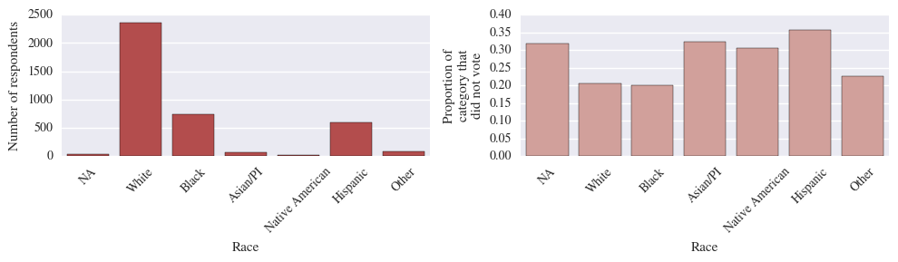
  <b>Figure 2: Non-voter proportions by ethnicity.</b>
                Data from 2000-2008.

Given that both the youth and Hispanic vote frequently skew Democratic, it comes as no surprise then that respondents who prefer Democratic spending priorities have higher proportions of non-voters than those who do not (Figure 3).

  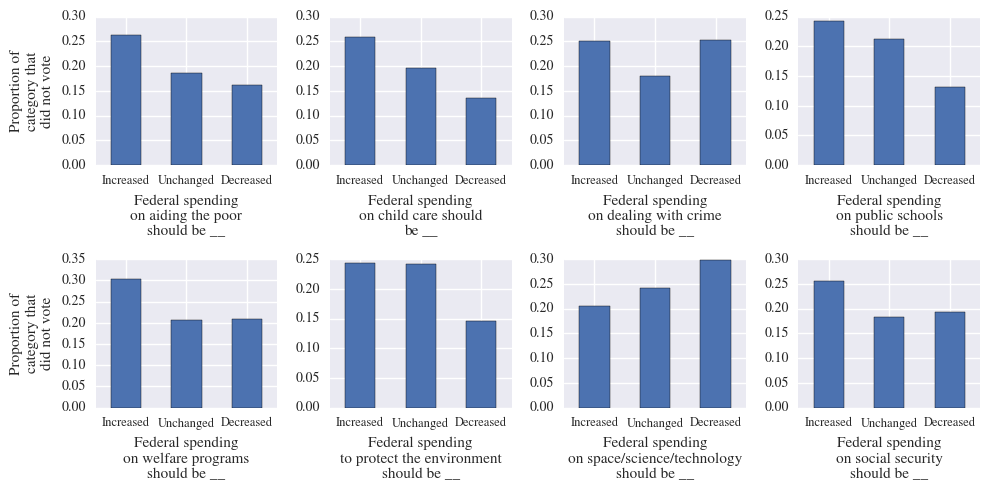
  <b>Figure 3: Proportion of non-voters per spending preference.</b>

Figure 4 shows a variety of other features that appear related to voting propensity. Notably, demographic characteristics like higher levels of education, frequency of church attendance, and social class are correlated with increased vote participation, as are less surprising ideological characteristics like higher levels of partisanship and interest in the election. The results for a particularly interesting survey question, "How much do elections make government pay attention to people?" seem to suggest that not voting may also be tied to cynicism regarding the responsiveness of government.

  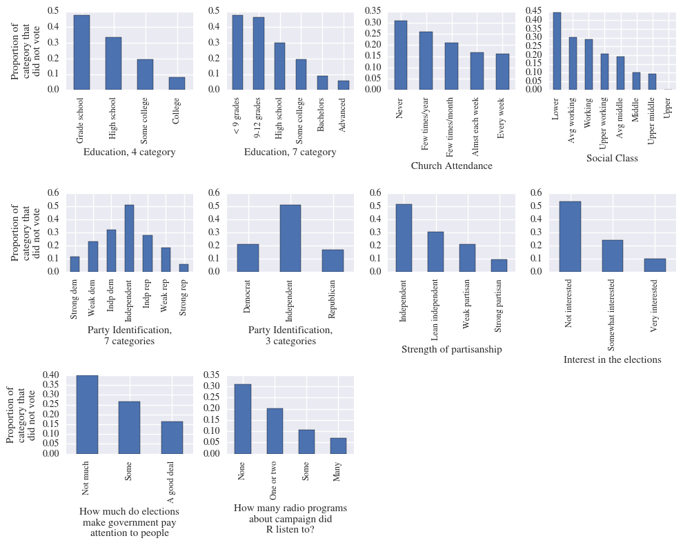
  <b>Figure 4: Proportion of non-voters per response for miscellaneous ordinal features.</b>

Finally, a t-Distributed stochastic neighbor embedding (t-SNE), a non-linear dimensionality reduction algorithm optimized for visualization, shows that there may be no clear separation between voters and non-voters (Figure 5). The absence of obvious clustering or separation in the data suggests how similar voters and non-voters can appear, yet the distribution of voters and non-voters is not completely random or uniform either.

  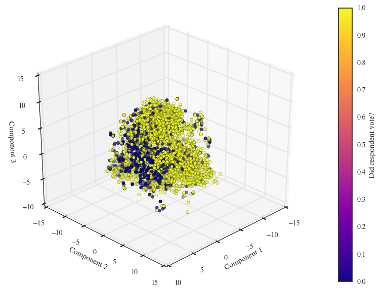
   
  <b>Figure 5: Embedding respondent data onto a three-dimensional subspace using t-SNE.</b>

### Methodology (Part 1)
The underlying premise of this project is that if a classification algorithm can identify non-voters within a survey's sample of eligible voters, then excluding those respondents will lead to more accurate predictions of the election day outcome, such as the popular vote. Specifically, I sought to test the efficacy of this method on three target election years, 2004, 2008 and 2012, using data from 2000, 2000-2004, and 2000-2008, respectively.

Because the Cumulative Data File already contains common features from 2000 to 2012, the most difficult data wrangling work of recoding feature names and standardizing values had already been performed. However, a significant amount of data cleaning remained in the form of re-encoding categorical features and smoothing the uneven distributions of quasi-continuous features. Of particular consequence was the decision to re-encode "I don't know" responses as their own binary feature for a number of ordinal and continuous features where such a response did not fit into an ordering scheme. I made this decision out of a hunch that, for many of the survey questions, respondents who answer "I don't know" would be more likely to not vote (Figure 6).

  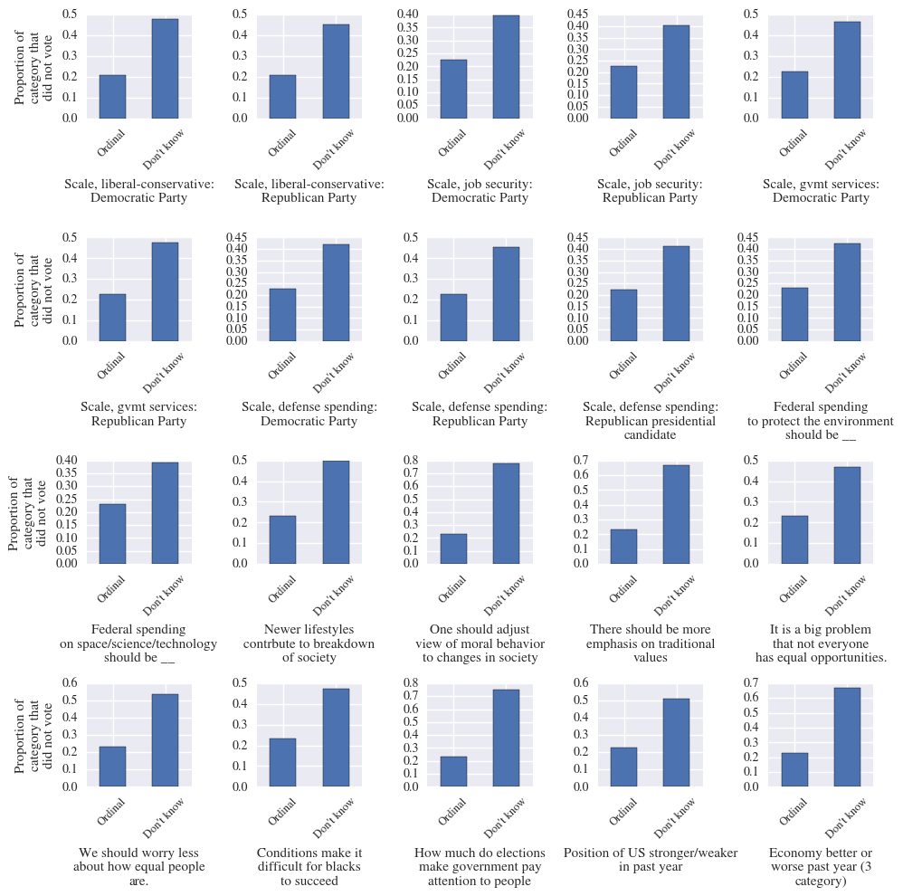
  <b>Figure 6: Respondents who answer "don't know" have higher non-voter proportions.</b>

An early challenge to overcome was the fact that the amount of data available for each election year varies drastically, as can be seen in Figure 7. Not only is there less training data relative to test data for each target year, but the amount of training data available for testing on 2004 is vastly less than that for 2012, meaning that an optimal feature set for identifying non-voters in 2012 may contain too many features and cause overfitting when attempting to do the same for 2004. Thus, to automate the feature selection process, I used [recursive feature elimination](http://scikit-learn.org/stable/modules/generated/sklearn.feature_selection.RFECV.html) with logistic regression to determine the best combination of features for each target year.

    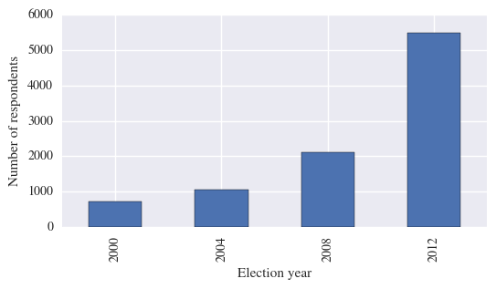
     
    <b>Figure 7: Number of respondents per election year.</b>

In order to determine the best classification algorithm for developing a likely voter model, I initially tested six methods using an F1-score with 5-fold cross-validation: logistic regression, adaptive boosting, Bernoulli Naive Bayes, support vector machines, Gaussian Naive Bayes, and random forest. Gaussian Naive Bayes and random forests performed particularly poorly during these baseline tests and were subsequently dropped from the study.

### First Results and a Complication

Using the optimum feature sets and tuning the hyperparameters for the remaining models resulted in reasonably good cross-validated F1-scores of approximately 0.7 for each target year's respective training data, but as Table 1 shows, applying these trained models to their target years' data yielded less desirable scores. Furthermore, no single individual model stood out as clearly superior to the others.

    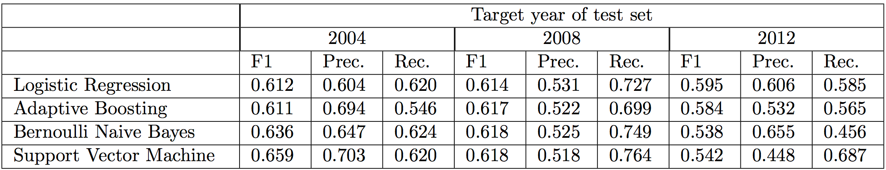
    <b>Table 1: Model performance on test data.</b>
    For each model and target year, the model's performance is scored using the F1-score, precision, and recall.

To leverage the strengths of each model, they were combined into a soft voting classifier, which resulted in better performance, though still not as effective as hoped (Table 2).

    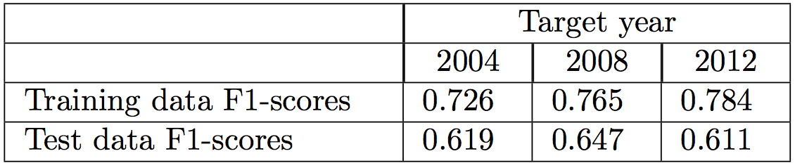
     
    <b>Table 2: Soft voting classifier performance on training and test data.</b>
    For each target the year, the training data consists of all respondents from previous years no earlier than 2000.

In assessing why the models did not perform better in classifying non-voters and voters, I discovered that the ground truth of the ANES surveys may in fact be unreliable. Figure 8 shows that the voter turnout as measured by the ANES is consistently almost 0.2 higher than that measured by the well-respected [United States Election Project](http://www.electproject.org/national-1789-present), suggesting that ANES voter turnout data is severely inflated and likely a result of [social desirability bias](https://en.wikipedia.org/wiki/Social_desirability_bias). This means that a significant proportion of respondents likely claimed to have voted despite not voting, and therefore it would come as no surprise that any model attempting to classify respondents by vote participation would struggle to do so accurately.

    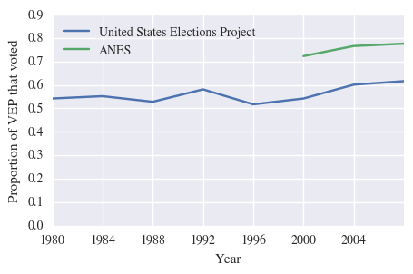
     
    <b>Figure 8: Voter turnout data differs by source.</b>
    According to the United States Elections Project, between 0.54 and 0.62 of the VEP has participated in national elections from 2000 to 2008. However, according to ANES, this range is from 0.72 to 0.78.

### Methodology (Part 2)
Although the ANES survey's ground truth of whether respondents voted may be unreliable, it is only the case for one class of categories. That is, I expected a respondent claiming to have voted despite not voting to be far more common than a respondent claiming to have not voted despite actually voting. Furthermore, a respondent who voted despite claiming no intention to vote would have no recorded candidate preference and could not be included in a survey-based prediction. Thus, I assumed the ground truth for those respondents labeled as non-voters to be reliable even if the same could not be said for those labeled as voters.

Because of this assumption, I rigged the models to aggressively identify as many non-voters as they could even if it resulted in a far greater likelihood of classifying voters as non-voters (within reasonable limits); after all, they may only be professed voters. If we consider non-voters as positive cases and voters as negative cases, this meant developing a model with a high recall, which was obtained by lowering the threshold for a positive classification. That is, if the probability that a respondent is a non-voter (as determined by the model's algorithm) was above a certain threshold, that respondent would be classified as a non-voter. Thus, a lower threshold meant more respondents classified as non-voters, resulting in an increase in both true and false positives.

After a model was trained from the target year's corresponding training data, its classification threshold was optimized to predict on the training data with a recall of 0.8, and the model was applied to the target year's data to generate vote/non-vote predictions. Admittedly, I chose the recall value of 0.8 arbitrarily, but it was based on the following intuition: requiring a model to correctly classify all positive cases (resulting in a recall of 1.0) would require a threshold so low as to be meaningless, yet a model with too low a recall would not have an inclusive enough picture of what constitutes a potential non-voter.

Conceptually, lowering the threshold to increase recall is akin to instructing the model to broaden its search for non-voters. The higher the resulting recall, the more complete a model's picture of what a non-voter looks like. With this broader picture, the model also identifies as non-voters those respondents who claim to have voted but display traits far too similar to those who have not. In this way, the model accounts for the suspiciously high proportion of respondents claiming to have voted.

### Results

Because the soft voting classifers yielded the best F1-scores for each target year's respective training data, they were used to generate vote/non-vote classifications in the model-based prediction. Figure 9 shows that the survey-based predictions using ANES data consistently overestimated the proportion of votes for the Democratic and third party candidates while underestimating that of the Republican candidate. By correcting down the share of votes for the Democratic and third party candidate and correcting up that for the Republican candidate, the model-based method consistently produced more accurate predictions.

    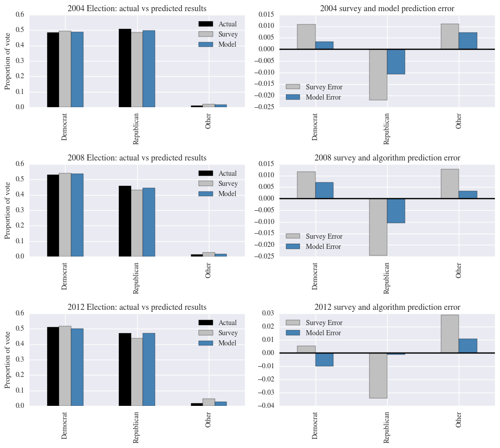
    <b>Figure 9: Actual and predicted popular vote results and corresponding errors.</b>
    The left plots show the proportion of voters that voted for each presidential candidate according to actual popular vote data, a survey-based prediction, and a model-based prediction. The right plots show the errors of the two predictive methods measured against the actual popular vote.

That the model-based prediction lowers the Democratic candidate's vote share while raising that of the Republican candidate's strongly suggests that respondents who prefer the Democratic candidate have a lower voting propensity and reinforces earlier findings showing that non-voters tend to favor Democratic spending priorities. In fact, Figure 4 shows that self-identified Democrats have a non-voting rate of 4% more than Republicans, unsurprising given that major components of the Democratic coalition, such as young adults, non-religous adults, and non-black minorities, are characterized by low vote participation. I expected non-voters to skew less Democratic in elections where the Democratic won the presidency, but based on the model's corrective tendencies, this behavior appears to have remained the same in 2008 and 2012 when Barack Obama, the Democratic candidate, won both presidential elections.

Oftentimes correctly predicting the margin by which one candidate leads another is more important than predicting absolute proportions, and here the model-based predictions were also consistently more accurate than survey-based predictions (Figure 10). In particular, a survey-based prediction using the ANES data would have projected a narrow popular vote win for Democratic presidential candidate John Kerry in the 2004 election, and in fact most polls leading up to election day were projecting a similar result. However, filtering out predicted non-voters resulted in a model-based prediction that correctly projected a popular vote win for President George W. Bush, the Republican incumbent at the time.

    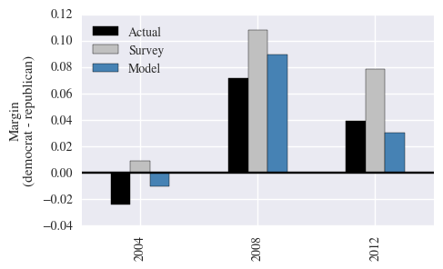
     
    <b>Figure 10: Actual and predicted popular vote margins.</b>
    The margin is calculated as the proportion of votes cast for the Republican candidate subtracted from the proportion of votes cast for the Democratic candidate.

While the results showed that using a soft voting classifier to filter out likely non-voters produced superior performance than relying on survey data alone, they came with the caveat that the model's positive classification threshold was altered to yield an arbitrary recall value of 0.8 on the training data. This begged the question of how sensitive model-based predictions were to different recall values. Figure 11 shows how the vote proportion predictions for each target year changes with respect to recall. A recall of 0.0 corresponds to a positive classification threshold of 1.0. That is, only those respondents for whom the model assigned a non-voting probability of 1.0 were classified as non-voters and thus had their voting intent discounted from the vote prediction. But because the model never assigned a non-vote probability of 1.0 to any respondent, a recall of 0.0 essentially reproduced the survey-based prediction.

    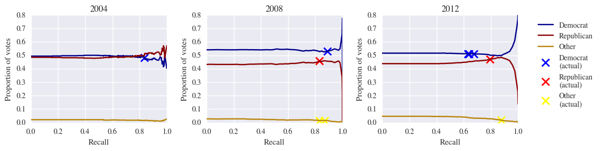
    <b>Figure 11: Effect of training recall on predicted vote results.</b>
                The crosses indicate the recall and vote proportion for which a perfect prediction was made.

For 2004, a training recall of 0.8 happened to be quite a good value as it led to a prediction quite close to the Democratic candidate's actual vote share. Furthermore, the model's predictions were rather stable and reasonably accurate for a relatively large range of recall values. From recalls of 0.6 to 0.95, the model would have accurately projected the George W. Bush the winner of the popular vote despite survey data suggesting the contrary, and within this range, the model's predictions for the Democratic and Republican shares of the popular vote never deviated too far from the actual result.

For predicting the 2008 popular vote, a training recall of greater than 0.6 was required for the effects of the model to be visible. Any training recall from within the range of 0.65 and 0.95 generated an improvement over the survey-based prediction, and once again, a training recall of 0.8 appears to have worked well. Notably, the recall value necessary for a correct prediction of the Democratic share of the vote was quite close, within 0.07, to that for the Republican share.

Of the three target years tested, the model's performance with respect to training recall was least stable for 2012. Whereas the models for previous presidential elections yielded training recall ranges for which the predicted vote shares for Democrats and Republicans do not deviate too much, the model for 2012 had no such range.

    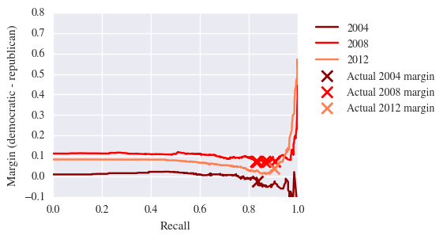
     
    <b>Figure 12: Effect of training recall on predicted vote margin.</b>
    The margin is calculated as the proportion of votes cast for the Republican candidate substracted from the proportion of votes cast for the Democratic candidate. The crosses indicate the recall and margin for which a perfect prediction was made.

Finally, examining how different values for training recall affect the popular vote margins showed that  recall values between 0.6 and 0.9 reliably resulted in more accurate predictions of the vote margin for all three election years (Figure 11). Thus, while the favorable results presented earlier relied on choosing an arbitrary recall of 0.8, selecting a different recall value from within a relatively wide range of 0.6 to 0.9 would have produced improved predictions as well. This shows that using a modified soft voting classifier to filter out likely non-voters was an effective method for refining a poll's accuracy and was robust against varying assumptions about appropriate training recall conditions.

### Conclusion

In investigating the effectiveness of using machine learning techniques to classify voters and non-voters, I found that while no single model stood out definitively as the most effective for classifying voters and non-voters, models taken in combination via a soft voting classifier yielded the highest F1-scores on test data from 2008 and 2012. Furthermore, modifying these soft voting classifiers to account for respondents' social desirability bias and then using them to identify and exclude non-voters from the survey samples resulted in significantly more accurate predictions of the US presidential election popular vote for 2004, 2008, and 2012.

Broadly speaking, I consider this project an initial proof of concept: that machine learning can be applied to national election surveys to enhance their accuracy in predicting the popular vote. Practically, however, accurately predicting the national popular vote is of limited use as American presidential elections are decided not by who wins the most votes but rather who wins the electoral college. Thus, whether this same method yields similar results for state-wide and local elections remains a crucial but unanswered question.

Many pollsters currently develop likely voter models using the Perry-Gallup likely voter index, in which the respondent's answers to seven questions determine whether they are classified as likely voters. Because the ANES survey was not meant to be an election poll but rather a broader study, it does not include a complete set of Perry-Gallup questions. Yet another avenue for further study, then, is how a machine learning method of identifying non-voters compares with traditional methods of determining the likelihood to vote.

Given the importance of polling to news organizations in gauging public sentiment and to candidates when devising campaign strategies, the continuing difficulty of developing likely voter models presents a prime opportunity for the application of machine learning techniques. This project demonstates just one instance in which machine learning can provide better polling results, and I hope others are encouraged to test this study's reproducibility with different voter files as well as extend and improve upon it with even more powerful methods.